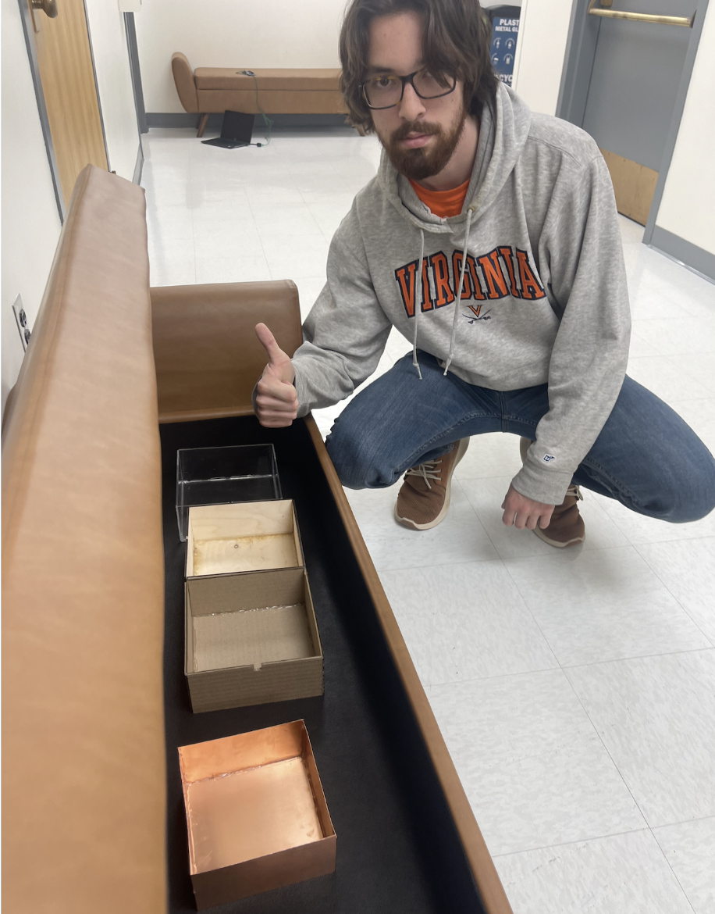

Course Projects
---------------

The 2023 Wireless for IoT course culminated in a series of final projects led by
individual groups. Each group was challenged to build a new wireless device,
experiment with new software for wireless IoT devices, or investigate wireless
IoT networks in the real world.

**Project List:**

<!--

* TOC
{:toc}

-->

## WiFi to LoRa

**Members:** Alicia Land, Jerry Pinto, Martin Salzberg

Although we have only covered one radio mode at a time in classes and labs for
the Heltec boards, they have multiple options for radios, so we would like to be
able to leverage multiple modes at a time. Inspired by the way smartphones can
seamlessly toggle automatically between Wi-Fi and cellular network modes, we
will create a way to do the same for Heltec boards toggle between Wi-Fi and LoRa
modes. For instance, a smartphone may have Wi-Fi mode enabled, but if it is not
in range of a known Wi-Fi network, it will not connect to Wi-Fi and will instead
default to cellular service. In a similar manner, if a Heltec board is not
connected to a Wi-Fi network, it will default to LoRa mode if it needs a direct
connection to another board. There could be a variety of reasons that a board
isn’t connected to Wi-Fi, such as being out of range or the Wi-Fi network losing
power, so it should be in LoRa mode by default but continuously check whether it
can connect to Wi-Fi. If the board is in range of a known network and can
connect, it will do so, but if it is disconnected, it will use LoRa instead.

## Local Smart Device Control with NFC

**Members:** Stephen Laming, Alan Gray, Andrew Hunter

Our final project is an NFC based smart device controller that would allow
anyone with a compatible smartphone to access and control a designated smart
device. Current smart device technology usually requires the user to connect to
the device through either bluetooth or wifi. This form of connectivity has two
problems: pairing and security. Every user of the smart device currently needs
to discover and pair with the device for use. This requires effort and time, but
also finding the correct device to connect with can be challenging if a user is
surrounded by many devices (connecting to one smart light in a building full of
them). Additionally, this type of connectivity allows users who are not
physically nearby (could even be outside the building) to still control devices.
An NFC based controller would solve both of these problems.

## Remote Laundry Detection

**Members:** James Connors, Brian Christner, Quinn Ferguson

Living in a house with multiple people who share a single laundry room can
sometimes get complicated. Our laundry room is in the basement, so we cannot
hear when the laundry has completed from our upstairs rooms. This can cause a
lot of problems, as when one person is late moving their laundry, it holds up
the machines for everyone else in the house as well. So, the idea of our project
is to create a system which will make it easier for us to know when our laundry
is ready. In this project, we used a Heltec WiFi Kit as a WiFi webserver to host
a laundry API site on our local network. Users of our laundry room can sign on
to this website, and sign up their phone to receive a notification upon
completion of the washer or dryer. After submitting this form, the WiFi kit
notifies a raspberry pi over USB to start taking photos of our washer and dryer.
Every 30 seconds, the raspberry pi will process images of the washer and dryer,
and notify the WiFi kit of the current status. If a user signed up for
notifications for a machine that has turned off, the WiFi kit will use the
Twilio API to notify the phone number that the machine has completed.

## GPS Asset Tracker

**Members:** Alan Zheng, Victor Xia, Nathan Yu

Asset losses due to theft are a common problem for any company that has assets
available for use by the public. Our project implements an asset tracker using
the LoRaWAN wireless protocol and GPS. The GPS board is connected to the Heltec
Wifi Lora 32 (V3) board via Serial, and the location data is packaged into a
payload along with the device ID. The payload is processed through The Things
Network(TTN), and stored into a database via the native Storage Integration API
available on TTN. The GPS data is visualized via the GeoViews and
ttn-storage-api libraries. The data can be visualized by ID, and the location
points are ordered by most recent to least recent, with most recent data points
being red and least recent data points being blue.

## Accumulated Temperature Data Compression

**Members:** Richard Wang, Coleman Jenkins, Alexander Hails

Imagine a scenario where a remote research station in Antarctica required a
temperature sensor to transmit long term readings of outdoor temperature back to
the researchers stationed a moderate distance away. In such a scenario, it would
be crucial to do this in a manner that would preserve as much of the limited
power available as possible, yet maintain the range so that the research team
would not have to brave the harsh temperatures getting close to the sensor. A
great protocol for this is LoRa because of its inherent long range and low
power. But, a problem is that if we were to transmit every collected temperature
value, we would waste power on the overhead required. So to minimize bandwidth,
we will implement data compression on the LoRa device, send multiple temperature
readings in one packet, and decompress them on the receiving end. And to make
this interpretable, we will implement a display for the collected data.

[[github](https://github.com/colemanjenkins/lorawan-temperature-compression)]

## Third Party Bus Tracking

**Members:** Nick Cooney, Justin Cary, Stephen Klem

Students at the University of Virginia (UVA) and members of the greater
Charlottesville community often rely on the University Transit Service (UTS) and
Charlottesville Area Transit (CAT) for transportation to and from class, work,
grocery stores, etc. One complaint users frequently have with the UTS and CAT
systems is the poor user experience provided by their respective route tracking
applications. Specifically, both applications are miraculously inconsistent in
the quality of their arrival time predictions. Naturally, the semi-stochastic
nature of traffic in the greater Charlottesville area makes it inordinately
difficult to predict exact arrival times. To address this issue, this project
aims to enable Charlottesville citizens and students alike to make informed
decisions about their potential transit usage by tracking individual bus
locations through the Internet of Things (IoT). The primary IoT protocol
handling communication between buses and users is LoRaWAN. By taking advantage
of GPS technology, LoRaWAN devices deployed on each bus can send location data
to nearby LoRa gateways for upload to an online server. That location data can
then be accessed by a client application to allow users to view current bus
locations, and make informed decision about their potential transit usage.
Future work could utilize machine learning to generate arrival time predictions
based on this location data and traffic patterns from other data collection
methods.

[[github](https://github.com/ncooney/transit-tracker)]

## Animal Location Tracking

**Members:** Francesca Pirozzoli, Kevin Bruzon, Serhii Maltsev

Nowadays, many biologists all around the world are trying to preserve endangered
species of animals. Therefore, it is extremely important to track the location
of these animals to prevent them from being stolen. Moreover, some farmers need
a way to keep track of the location of their animals that can get lost or
stolen. This problem requires an inexpensive solution that can work over a long
distance and would not require a lot of energy to transmit the signal.

The solution we propose is to integrate a GPS radio with the Heltec LoRa board
for animal tracking. The LoRa GPS is attached to animals to help track and
monitor their movement at all times. The idea is that when the device reports a
location out of a certain allowed range, an alert is sent to TTN and then
reported to the server parsing the data from the broker.

Using Lora+GPS is an ideal protocol for this task because it allows for
long-range, low-power connections, enabling the GPS readings to be transmitted
quickly and reliably to the TTN. Furthermore, this protocol is well-suited for
applications such as asset tracking, making it a great choice for our needs.
Also, unlike other GPS devices, the LoRa GPS enables data transmission at a
slower rate over long ranges. This makes the LoRa GPS an ideal tracker for
battery-operated applications.

One of the advantages of using Lora+GPS is that it is a cost-effective solution
compared to other wireless technologies. Additionally, it provides users with
good scalability and flexibility, allowing them to customize the range and power
of the connection.

On the other hand, one of the potential drawbacks of using this protocol is that
it is relatively new technology, which may present some challenges in terms of
reliability. Additionally, the size of the hardware may prove inconvenient to
install on fur or skin of the animal.

## NFC Classroom Applications

**Members:** Hunter Carlton, Ishan Koroth, Christopher Carrillo

Our final project will be an implementation of an NFC tag system, using our NRF
boards. Using our system, users will be able to use their smartphones to
interact with our device through Near Field Communication and exchange a small
amount of data between their devices and ours. We feel that we can effectively
use this system as both a logistical and educational tool in class. On any given
class day, our device, which could be scanned by students as they entered a
classroom, would serve as an automated attendance (check-in) system,
additionally providing the users’ devices with the URL link to the class’s
pre-class mini quiz (should there be one that day). Additionally, if our system
were duplicated, it could serve as hands-on, modular education system in the
classroom. If used in this way, multiple “stations” could be set up around a
classroom for an in-class activity, and groups of students could progress
through the stations, with each device taking their phone to a webpage dedicated
to teaching a specific sub-topic of the day’s material (in a similar way that
patrons of a museum might progress through an exhibit and learn information at
every stop using an audio-tour device). Finally, along with the following
functionalities, we have also incorporated what we learned in class regarding
BLE technology like implementing a peripheral-central system that can be used to
keep track of NFC activity and which specific URL is being notified to the
phone. Not only would this be making use of NFC technology in a productive way,
but it would also increase engagement and interest in the class as students
interact with NFC technology and learn the topics taught in class in a very
unique way.

[[github](https://github.com/ik4vrb/nfc-checkpoints)]

## LoRa + GPS

**Members:** Gabriele Bright, Stephanie Skahen, Zach King, Kelsen Donastien

Item tracking using BLE (ex. Airtag, Tile) is becoming more and more
commonplace. However, it only works when there is an abundance of other BLE
devices that packets can get routed through due to the short range of bluetooth
signal. Rural areas lack this abundance, but farmers and ranchers could still
desire the use of tracking devices, especially for keeping up with free range
animals. However, the lack of BLE reception leaves two potential solutions: they
can utilize a 4G or 5G connection to upload GPS information to a server or
utilize a LoRaWAN network with LoRa devices and a broker, like The Things
Network, to cache the data. The first option can lead to problems for residents
of rural areas – currently, high speed data connectivity is not widespread
throughout these areas. For low-data needs, especially when it comes to GPS
data, integrating LoRaWAN into these areas would be a cheap, simple way to give
these people access to important information across long distances.

Our project involves the use of LoRa devices that send GPS data to The Things
Network, allowing for this data to be received and processed by another machine
via the Internet. This design would have many uses for those without stable
non-LoRaWAN connection. For example, LoRa devices could be attached to cattle
before they are released into large grazing areas. Because the LoRa devices
continually send GPS data to TTN, a farmer could monitor the movement of their
herd using an application on their personal machine (with Internet connection)
by pulling this data from TTN, parsing it, and plotting this data onto a map. Of
course farmers are not simply limited to just livestock theft or loss of heavy
equipment machinery is a consistent concern for farmers as they comprehend how
costly loss of the equipment itself in addition to the loss of productivity by
not being able to make use of the tools in the field. This technology could be
especially valuable if a farmer has a predetermined area or space they occupy
and move their equipment in a known pattern. In the case of cattle being able to
monitor grazing habits over time and shift position can be useful.

[[github](https://github.com/butterflygit/WIoT-Group22-Final)]

## Physical Interference

**Members:** Sebastian Segura, Zachary Nahorney, Tahmid Bhuiyan

Our research question investigates the physical obstructions that significantly
affect the loss of signal strength between two antennas by identifying materials
that can mitigate this signal loss. By conducting this research, we hope to
facilitate stronger connections between devices and reduce costs for wireless
companies. These companies can then optimize their networking systems by
implementing the most suitable protocol for their specific use cases from the
outset, rather than continually substituting existing radio technologies.

Our objective is to identify that minimizes signal strength degradation over
time. We plan to test protocol transmissions against various materials, such as
wood, acrylic, and metal, to determine which combinations of materials and
protocols maintain the strongest signal strength upon reception by an end
device. To measure the received signal strength indicator (RSSI) values, we will
construct boxes from these materials and place the receiver inside. With these
values, we can get an estimate of if buildings were primarily constructed out of
each material, which one would degrade the signal the least. Using these values,
we can estimate which material, if primarily used in building construction,
would cause the least signal degradation.

## 4G Coverage on Grounds

**Members:** Phyl Peng, Declan Brady, Angelo Bechtold

Long range signal transmission can have blind spots well within their proposed
range–as we have seen for LoRa and BLE, where the theoretical range is a lot
shorter or is significantly reduced due to the objects in the environment. LoRa
has a proposed range of 3 miles in urban areas, but as shown in the results of
the measurements in this class, it can have certain blind spots well within the
3 mile range, especially in underground settings such as basements. 4G/5G are
important means of communication on Grounds, and they are relied upon for real
time communication in case WiFi fails. Yet, it is sometimes reported that the
4G/5G coverage on Grounds is not ideal, especially in terms of underground
environments.The Engineering School has a lot of buildings where the basements
are environments where important experiments take place. Having robust and
redundant communication is important for the safety of both the faculty, staff,
students, and their work. Hence, we propose to measure the 4G/5G coverage in the
E-School and around grounds. We will use various internet speed measurement apps
on our phones to collect the data at specific geographic locations, indoors and
outdoors. Using this data we can then create heatmaps for both indoor and
outdoor settings, exploring the differences and enlightening the community to
areas of low coverage.

[[Outdoor 4G coverage map](https://app.mapline.com/map/map_50b985b6/P2J6Pz8xPz8UGz8UP04UP20UYSUUBXMUIk4UPzZdPxEUP2kUPz)]
[[Indoor 4G coverage map](https://app.mapline.com/map/map_626cf33e/PjwUPz8UPz8TPz8QPy58Um0KLj8UPz8aPz8UPz8-P3kHP3kUPz)]

## MuseumGuide

**Members:** Anish Mandalika, Cal Hartzell, Jacob Rice

Our project solves the problems faced by museums and other institutions when
trying to present patrons with smartphone-based experiences tied to specific
pieces/displays. QR codes are unattractive in appearance and often unruly to
scan for patrons, cannot be changed without physically replacing them, and offer
no way of tracking the popularity of specific pieces/displays. NFC tags, while
more attractive and easier to scan for patrons, cannot be changed without
physically approaching each tag and also offer no way of tracking the popularity
of specific pieces/displays. Our solution utilizes the nRF52840DK board and its
NFC and BLE capabilities, allowing museums and other institutions to change the
NFC payload presented to patrons, change the BLE device name, and view the
number of times a specific piece/display's corresponding NFC endpoint has been
scanned, by connecting to the board over BLE and reading/writing specific
characteristics. We also created a simple python program which can list
available nearby devices, modify device BLE names and NFC payload, and plot the
amount of NFC scans for all nearby devices. Our project solves the problems
faced by museums and other institutions when trying to present patrons with
smartphone-based experiences tied to specific pieces/displays. QR codes are
unattractive in appearance and often unruly to scan for patrons, cannot be
changed without physically replacing them, and offer no way of tracking the
popularity of specific pieces/displays. NFC tags, while more attractive and
easier to scan for patrons, cannot be changed without physically approaching
each tag and also offer no way of tracking the popularity of specific
pieces/displays. Our solution utilizes the nRF52840DK board and its NFC and BLE
capabilities, allowing museums and other institutions to change the NFC payload
presented to patrons, change the BLE device name, and view the number of times a
specific piece/display's corresponding NFC endpoint has been scanned, by
connecting to the board over BLE and reading/writing specific characteristics.
We also created a simple python program which can list available nearby devices,
modify device BLE names and NFC payload, and plot the amount of NFC scans for
all nearby devices.

[[github](https://github.com/anish3343/museumguide)]

## NFC Weather Station

**Members:** Justin Chen, Sriram Darbha, Ethan Hanover

The project we have implemented is a weather station that will use an NFC sensor
and phone companion app to visualize sensor (in this case, temperature) data at
a certain location and configure the station. Our motivation for this project is
to have a compact, accurate, and easy-to-use method of measuring local
environmental data in real-time. For example, building managers who want to
monitor the temperature in different areas to make repairs or farmers who want
to monitor data in their fields can use this app to customize and configure the
weather station to their needs. Every day people like homeowners can also use
the weather station to keep track of relevant weather data in their vicinity.
The project currently consists of a sample of temperature data, and by using the
NFC tag, the board can send the payload of data to the phone application. Within
the application, the data is formatted for user-friendliness, displaying the
current sample rate, current temperature, and a graph of the data. The user has
the ability to change the temperature sampling rate within the application, and
when held up to the NFC tag, can change the sample rate within the board to
collect temperatures based on the user’s preference. Since our motivation was to
create an energy-efficient, user-friendly weather station with bi-directional
communication, we ensured that all features/data within the board and
application were as efficient as possible. In the future, we would like to
implement more sensors so users can track more holistic data about the
environment.

## Parking Usage Tracker

**Members:** Josh Lee, Abel Ressom, James Zhu

For our final project idea, we have settled on using the Heltec LoRa board with
a GPS to implement a smart parking system for cities. This was inspired by a
combination of one of Tysons Corner Center’s parking garages which uses an LED
light fixture arrangement to set statuses for customers to park, and, to solve
the scarce street parking situation in the Cville area. In our use case, the
overall idea is to allow users to subscribe to a topic which will provide
information regarding which parking spots are taken and which are available. In
practice, this would reduce the time a user has to spend driving around the busy
streets of a city and reduce the chance of car accidents occurring in parking
lots — which accounts for 20% of all car accidents. We implemented the MQTT
network protocol: broker, DUT and inspector from Assignment#4 to process the
information and create a structure to hold the coordinates as well as the status
of the parking spots. Specifically, the broker acts as the access point, the DUT
handles storing the coordinates/status of the spots, and the inspector handles
the button pressing and sending of coordinates.

 
 

## Motion Sensing Animal Tracking

**Members:** JC Crawley, Alex Yang, Roy Jad

Our project’s goal was to create a motion sensor activated camera to detect
animals. The camera takes a photo before saving it to a microSD card and sending
it to a web server on a connected network using Wi-Fi. It’s a cheap option that
automates the task of taking photos at home for viewing.

Our finished product is able to successfully receive input from the PIR sensor,
take a photo, and upload that photo to the web server (given enough time).
However, we had trouble calibrating the PIR sensor, so it’s inconsistent in
actually sending the signals. Additionally, we found the camera was cut off
before transmitting an entire image, so we changed the image quality and added
an increased delay after the photo was taken. We also had difficulty working
with the system in general because we had to use different hardware setups to
upload code, view the serial output, and actually run the system with the
sensor. This made it difficult to debug specific issues we came across. These
are the materials in our system:

## LoRa Enabled Robotic Mowing

**Members:** Justin Dubuque, Robbie Owens, Stephen Johnson

Commercial landscaping is both an expensive and polluting activity that may be
vastly improved with self-driving, battery-powered lawnmowers. We believe that
by combining GPS and LoRa technology, it is possible to monitor and manage an
energy-efficient network of autonomous mowers. GPS may be used to periodically
check the location of the devices and map out the mower’s progress, and LoRa may
be used to facilitate communication between the devices and the central location
over long distances. With this approach, corporations with large plots of land
may view what land has been mowed and how much battery each mower has, and they
may send commands to the devices to return to base for charging when their
battery levels are low.

The End Device is a Heltec Wifi-LoRa V3 board which pulls GPS information from a
GT-U7 GPS module via Heltec pins. The Heltec LoRa transmitter sends a 24 Byte
packet every 5 seconds communicating longitude, latitude, speed and battery
level. The battery level is simulated in code on the Heltec board trivially. The
Rice Hall LoRa gateway forwards these packets to a locally hosted lightweight
flask server running an MQTT client. This communication is facilitated via an
MQTT broker that exists on the Rice Hall Gateway. Finally, a React UI component
with google maps integration displays the coordinate of the device and the speed
with help from a flask web server. There is a circular shaded region around the
latest coordinates to estimate the maximum remaining range for the lawn mower
system.

[[github](https://github.com/robbieowens15/UVA_CS4501_S23_IoT_FINAL_PROJECT)]

## LoRa Messaging

**Members:** William Bigger, Cynthia Wang, Jiafu Li

We built a Python interface that can control LoRa and can send plaintext
messages that are longer than a typical LoRa packet. Since a regular LoRa packet
can only contain up to 256 bytes of payload. Furthermore, it is useful for file
transmission in remote places without much infrastructures such as wi-fi
available.

## Reservation Queue for Gym Equipment

**Members:** Connor Goodall, Adam Kippenhan, Boheng Mu

Our project is an example of a solution for reserving gym equipment. This allows
gym-goers to have the freedom to use other equipment in the gym while having
the comfort of knowing that their spot in line to use their desired machine is
secure. We designed this system using Near-field communication (NFC), Bluetooth
Low Energy (BLE) and an accompanying custom Android app designed for this
project. To use the system, the user scans the NFC tag on the piece of equipment
they want to reserve. The NFC tag provides information to the user’s device,
informing them that they have joined the reservation queue and allowing them to
form a BLE connection. The gym equipment has a timer that times each user’s time
on the equipment for a configurable amount of time (for demonstration purposes
we have chosen 60 seconds). When each user moves up in the queue, they are
notified so that they can be made aware as they reach the top of the queue. The
app informs the user of their position in the queue and how much time they have
left before they reach the top of the queue and their time slot for the
equipment becomes available. This system will allow users to make more efficient
use of their time in the gym and focus more on their workout instead of waiting
for a certain piece of equipment to become available.

## NFC Pet Tag with BLE

**Members:** Randall Bingaman, YJ Cho, Raymond Wen

Pets are an integral part of people's lives, and it's incredibly stressful when
they get lost. Our proposed project is to create a NFC Pet Tag with BLE. Our
motivation behind this project was to create an easier way for pet owners to
tag, keep track, and be alerted for when their pets are about to leave. Often
pets can get loose and it becomes an enormous challenge to find them and get
them back. We would allow pet owners to read and write a profile for their pets
(containing the owner name, phone number, address, pet name) on their NFC tags,
so that people can scan them if they got lost and learn pertinent information
about the pet. We would also create an alert system (which we model with a
blinking light) to alert the owner if the pet left a certain range based on the
RSSI. Additionally, we have created a system where the owner can simply tap the
tag with their mobile device to get connected to BLE.

[[github](https://github.com/yjcho321/wiot19final)]

