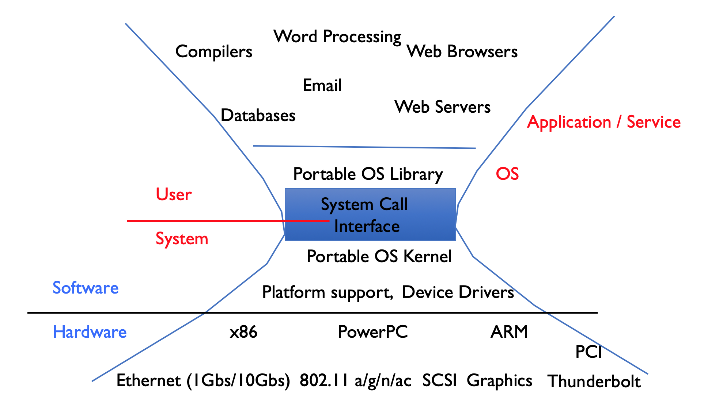
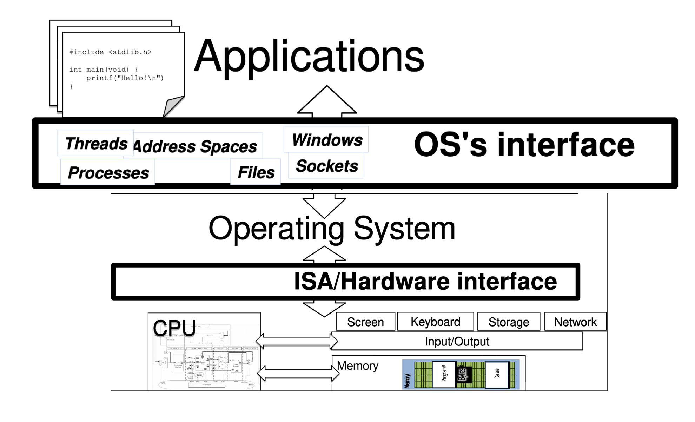

<!-- - **Course**: CS6456 - Fall 2019
- **Instructor**: Brad Campbell
- **Time**: M/W 2:00-3:15pm
- **Location**: 340 Rice
- **Office Hours**: TBD

--------------------------------------------------------------------------------
 -->

<!-- 
 -->

This is an advanced course in computer operating systems. We discuss principles
of operating systems, distributed systems, networking, specialized operating
systems, real-time operating systems, embedded operating systems, and other
related topics.

This course is not primarily research-paper focused, but will leverage research
papers for various topics, particularly later in the semester.

Deliverables
------------

This course will include five programming-based homeworks and a take-home final
exam.

- [HW1](hw1.html): A Simple Shell
- [HW2](hw2.html): A Userspace Threading Library
- [HW3](hw3.html): A Multi-Storage Filesystem

Grading
-------

<!-- Your grade for the course will be based on: individual or group project,
paper reviews and peer-review of final projects, and in-class
participation and discussion lead. -->

- 15%: HW1
- 15%: HW2
- 15%: HW3
- 15%: HW4
- 15%: HW5
- 25%: Final Exam

Homework Policies
-----------------

- All homeworks must be completed individually.
- You may submit each homework up to two days late. Ten percentage points will
  be deducted from the final score for any assignment submitted on the day after
  the due date, and twenty percentage points will be deducted for any assignment
  submitted on the second day after the due date.
- All homeworks will be submitted through Collab.

Honor
-----

I trust every student in this course to fully comply with all of the provisions
of the University’s Honor Code. By enrolling in this course, you have agreed to
abide by and uphold the Honor System of the University of Virginia.

### Collaboration Policy

- Each homework should be completed individually. You may discuss the
  assignments with others at a high level, but the implementation _must_ be your
  own. For debugging, you may talk through the issue you are having with others,
  but you may not share code that solves the problem.
- The final exam must be done entirely individually.

Schedule
--------

| Class     | Topic                 | Reading                | Due        |
|-----------|-----------------------|------------------------|------------|
|           | **OS Fundamentals**   |                        |            |
| W, Aug 28 | [~~Intro~~](slides/01-intro.pptx), [Processes](slides/02-process.pptx) | [The Night Watch (if you are interested)](https://www.usenix.org/system/files/1311_05-08_mickens.pdf) |            |
| M, Sep 2  | ✘ No Class. Labor Day. |                        |            |
| W, Sep 4  | [Synchronization](slides/03-concurrency.pptx) | |           |
| M, Sep 9  | ✘ No Class.             |                        |            |
| W, Sep 11 | [Scheduling](slides/04-scheduling.pptx) |      |            |
| M, Sep 16 | [I/O](slides/05-io.pptx) |                     | HW1        |
| W, Sep 18 | [Memory & Caching](slides/06-memory.pptx) |    |            |
| M, Sep 23 | [Filesystems](slides/07-filesystem.pptx) |     |            |
| W, Sep 25 | [MMAP & IPC](slides/08-mmap.pptx) |            |            |
| M, Sep 30 | ✘ No Class. Work on HW2. |                     |            |
| W, Oct 2  | [Security](slides/09-security.pptx) |          | HW2        |
| M, Oct 7  | ✘ No Class. Fall Break. |                      |            |
|           | **Changing Hardware** |                        |            |
| W, Oct 9  | [Networking](slides/10-networking.pptx)            | [End-to-end argument](https://groups.csail.mit.edu/ana/Publications/PubPDFs/End-to-End%20Arguments%20in%20System%20Design.pdf) |            |
| M, Oct 14 | [Distributed systems](slides/11-distributed1.pptx) | [Spanner](https://static.googleusercontent.com/media/research.google.com/en//archive/spanner-osdi2012.pdf) |            |
| W, Oct 16 | [Distributed systems](slides/12-distributed2.pptx) | [Dynamo](https://www.allthingsdistributed.com/files/amazon-dynamo-sosp2007.pdf)                            |            |
| M, Oct 21 | ✘ No Class.           |                        | HW3        |
| W, Oct 23 | [Kernel Architectures](slides/13-kernels.pptx)     | [Exokernel](https://pdos.csail.mit.edu/6.828/2016/readings/engler95exokernel.pdf), [Multikernel](https://www.sigops.org/s/conferences/sosp/2009/papers/baumann-sosp09.pdf) |  |
|           | **Changing Requirements** |                        |            |
| M, Oct 28 | [Heterogenous Hardware](slides/14-nvm.pptx)        | [SplitFS](https://www.cs.utexas.edu/~vijay/papers/sosp19-splitfs.pdf) |            |
| W, Oct 30 | [OS for AI](slides/15-ml.pptx)                     | [Tensorflow](https://www.usenix.org/system/files/conference/osdi16/osdi16-abadi.pdf)                        |            |
| M, Nov 4  | Security              | [ZebRAM](https://www.usenix.org/system/files/osdi18-konoth.pdf)                        |            |
| W, Nov 6  | Virtualization        | [Formal Requirements for Virtualization](http://citeseerx.ist.psu.edu/viewdoc/download?doi=10.1.1.141.4815&rep=rep1&type=pdf), [Xen](https://www.cl.cam.ac.uk/research/srg/netos/papers/2003-xensosp.pdf)                       |         |
| M, Nov 11 | ✘ No Class. SenSys.   |                        |            |
| W, Nov 13 | ✘ No Class. SenSys.   |                        | HW4           |
| M, Nov 18 | Embedded OS           |                        |            |
| W, Nov 20 | RTOS                  |                        |            |
| M, Nov 25 | Verification          |                        |            |
| W, Nov 27 | ✘ No Class. Thanksgiving Break. |              |            |
| M, Dec 2  | Mobile/Car/Robot OS   |                        | HW5        |
| W, Dec 4  |                       |                        | Final Exam |

<!--

IDEAS

- drivers
- encrypted filesystems

student push!
https://twitter.com/i/status/1176952930899046403

NOTES

- mmap lecture not great...

Oct 14
- how does spanner handle delays in the os when getting time?
- end to end principle strictness
- does spanner work?

Oct 16
- making it the application's problem versus providing a more robust abstraction
- why does C(X) < C(T) not imply X->T

Oct 23
- downsides to exokernel system for someone trying to use the system or write apps
- if a system has X Y and Z cores, why would multikernel work and others not?

Oct 28
- how can we find places to use NVM in software?
- Why does NVM create consistency issues?

Oct 30
- three keys for ML take over
- issues with TVM comparison? (bad comparison baseline)
- how to evaluate tensorflow?
-->

Background
----------

Graduate standing and a previous operating systems course are the only
prerequisites for this course. We will not be following a textbook, but some
references you may find useful:

- [Operating Systems: Principles and Practice (2nd Edition)](https://www.amazon.com/Operating-Systems-Principles-Thomas-Anderson/dp/0985673524)
by Thomas Anderson and Michael Dahlin
- [Operating Systems: Three Easy Pieces](http://pages.cs.wisc.edu/~remzi/OSTEP/)
by Remzi H. Arpaci-Dusseau and Andrea C. Arpaci-Dusseau

Disabilities
-----------------------

The University of Virginia strives to provide accessibility to all students. If
you require an accommodation to fully access this course, please contact the
Student Disability Access Center (SDAC) at (434) 243-5180 or sdac@virginia.edu.
If you are unsure if you require an accommodation, or to learn more about their
services, you may contact the SDAC at the number above or by visiting their
website at
http://studenthealth.virginia.edu/student-disability-access-center/faculty-staff.

Your Wellbeing
---------------

The Computer Science Department and SEAS aims to promote their students'
wellbeing. If you are feeling overwhelmed, stressed, or isolated, there are many
individuals here who are ready and wanting to help. If you wish, you can make an
appointment with me and come to my office to talk in private.

Alternatively, there are also other University of Virginia resources available.
The Student Health Center offers Counseling and Psychological Services (CAPS)
for its students. Call 434-243-5150 (or 434-972-7004 for after hours and weekend
crisis assistance) to get started and schedule an appointment. If you prefer to
speak anonymously and confidentially over the phone, call Madison House's HELP
Line at any hour of any day: 434-295-8255.

If you or someone you know is struggling with gender, sexual, or domestic
violence, there are many community and University of Virginia resources
available. The Office of the Dean of Students, Sexual Assault Resource Agency
(SARA), Shelter for Help in Emergency (SHE), and UVA Women's Center are ready
and eager to help. Contact the Director of Sexual and Domestic Violence Services
at 434-982-2774.

Diversity
---------

It is the instructors’ intent that students from all diverse backgrounds and
perspectives be well served by this course, that students’ learning needs be
addressed both in and out of class, and that the diversity that students bring
to this class be viewed as a resource, strength and benefit. It is my intent to
present materials and activities that are respectful of diversity: gender,
sexuality, disability, age, socioeconomic status, ethnicity, race, and culture.
Your suggestions are encouraged and appreciated. Please let me know ways to
improve the effectiveness of the course for you personally or for other students
or student groups.

Religious Accommodations
-----------------------------------

It is the University's long-standing policy and practice to reasonably
accommodate students so that they do not experience an adverse academic
consequence when sincerely held religious beliefs or observances conflict with
academic requirements. Students who wish to request academic accommodation for a
religious observance should submit their request in writing directly to me by
email as far in advance as possible. Students and instructors who have questions
or concerns about academic accommodations for religious observance or religious
beliefs may contact the University’s Office for Equal Opportunity and Civil
Rights (EOCR) at UVAEOCR@virginia.edu or 434-924-3200. Accommodations do not
relieve you of the responsibility for completion of any part of the coursework
missed as the result of a religious observance.

