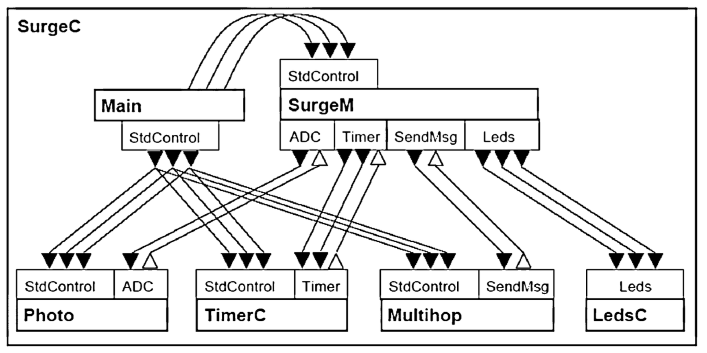
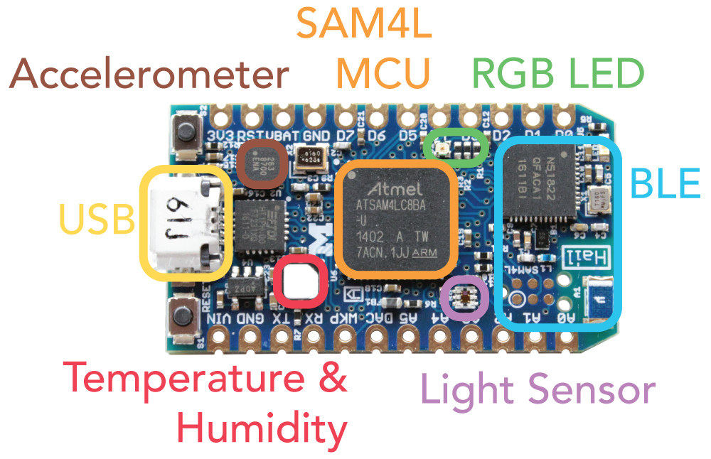
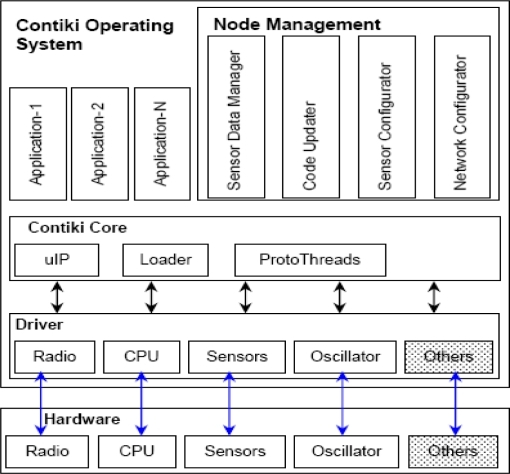

<style>
.masthead {
	display: none;
}
</style>


- **Course**: CS6501 (006) - Fall 2018
- **Instructor**: Brad Campbell
- **Time**: M/W 10:30am-11:45am
- **Location**: 340 Rice
- **Office Hours**: 241 Olsson: Tu 2-3pm, and Wed noon-1pm

--------------------------------------------------------------------------------






The Internet of Things promises to revolutionize how we interact with computers
by making embedded computation ubiquitous. New devices will be added to cities,
to homes, to factories, to ourselves (inside and out), to cars, and to many
other facets of life. The hope is that this influx of technology will help us
solve many pressing societal issues in areas such as energy, personal health,
the environment, and safety. While there are a range of challenges to enabling
this scale, this course will focus on the software environments running on IoT
devices.

Embedded operating systems and software stacks running on embedded nodes must
balance numerous challenges while effectively supporting developers and
potential applications. OSes for embedded devices often operate with very
different assumptions and have different constraints than desktop and server
operating systems. Embedded devices often are expected to run unattended for
months or years, without a user interface, on a minimal energy budget, while
responding to application-specific events and using an often unreliable wireless
network interface. How should embedded operating systems manage these
constraints while providing a programming model to developers that encourages
reliable and effective devices for a range of applications?

This course will dive into the details of embedded operating systems using three
case studies to ground the discussion. It will start with motivating
applications to highlight what embedded devices may be tasked with, and describe
the types of hardware platforms OSes may run on. Then, the course will explore
different operating systems, their design decisions and tradeoffs, and a range
of requirements that are critical in the IoT space.

As a graduate seminar, this course will focus on reading, analyzing, and
discussing research papers. The course will focus on very recent research (last
2-5 years), but will also include older, more foundational papers for certain
topics. There will also be an instruction component to the course to establish
fundamental principles in this space.


Deliverables
------------

This class requires three main deliverables from students.

### 1. Paper Reviews

Before each class with assigned papers you must read and write a short review of
each assigned paper. The review should answer the following questions:

- What is the problem this paper addresses, and why is it important?
- What is the hypothesis of this paper?
- What are two key assumptions that this paper makes?
- What are the two main strengths of this paper?
- What are the two main weaknesses of this paper?
- Which figure or experiment was most compelling in support of the hypothesis,
  and why?

Additionally, the review should include ratings for how you perceive the paper
in the following categories:

- Presentation (1-5)
- Interest (1-5)
- Impact (1-5)
- Overall (1-5)
- Confidence (1-5)

The reviews must be entered in the [review
site](http://joule.cs.virginia.edu/hotcrp/cs6501-f18/) before the start of each
class and should be used as reference notes for the in-class discussion.

Note: it will always be easier to find weaknesses than it is to find strengths
when reviewing a paper. After all, the authors had a limited number of pages!
Try to find the merits that lead to the paper getting accepted while you read
each paper.


### 2. In-class Discussion Lead

You must select one class (that has assigned papers) where you will be the
discussion lead for the assigned papers. You should come prepared to give an
overview of the paper, and guide a discussion about the strengths, weaknesses,
potential for impact, and connections to the operating system principles
discussed in class.


### 3. Homework

There will be short homeworks throughout the course. These will both
cover in-class lectures and discussions, and extend the general concepts.

### 4. Course Project

This class will feature a semester-long course project. The project can be one of:

- An IoT project using hardware and an embedded OS (not Arduino).
- A 6 page research paper.
- A different project subject to instructor approval.


<!-- This class will feature a semester long project focused on idea creation, idea
motivation, and the scientific method. You will choose a topic, develop a
hypothesis within that topic, develop a research plan to explore and evaluate
that hypothesis, provide some motivating preliminary data, and communicate these
results in the form of a written paper.

Note: this does not require actually building the system. In fact, it requires
that you _do not_ build the system, but rather work on the science aspects
before undertaking the engineering.

The project will have four milestones:

1. Monday, September 25: Two page paper covering your hypothesis, motivation,
and expected results.
2. Wednesday, October 25: Four page paper with planned experiments.
3. Monday, November 27: Five to six page paper with preliminary results.
4. Wednesday, November 29 and Monday, December 4: Project presentations.


For the two in-class project workshops, you will be expected to evaluate and
provide feedback for your peers' papers. -->


Grading
-------

<!-- Your grade for the course will be based on: individual or group project,
paper reviews and peer-review of final projects, and in-class
participation and discussion lead. -->


- 15%: Discussion Lead
- 15%: Paper Reviews
- 15%: In-class Participation and Discussion
- 15%: Quizzes
- 40%: Final Project and Presentation


Schedule
--------


| Class      | Topic                                                         | Lead     | Details                                                  |
|------------|---------------------------------------------------------------|----------|----------------------------------------------------------|
| Wed Aug 29 | [Introduction](slides/01-introduction.pptx)                   | Campbell | Overview of the topic and course. [Ubiquitous Computing](papers/weiser93ubiquitous.pdf)                                                                   |
|            | **Motivating Applications**                                   |          | What is the IoT trying to do?                            |
| Mon Sep 3  | [Smart Cities & Urban Environments](slides/02-city.pptx)      | Campbell | (1) [Array of Things](papers/catlett17aot.pdf), (2) [SeaGlass](papers/ney17seaglass.pdf)                                           |
| Wed Sep 5  | Smart Buildings                                               | Campbell | (1) [MotionSync](papers/jee16motionsync.pdf), (2) [Multi Modal Occupancy](papers/mohammadmoradi17occupancy.pdf)                                           |
| Mon Sep 10 | [Personal Health](slides/04-health.pptx)                      | Campbell | (1) [LIBS](papers/nguyen16libs.pdf), (2) [Geophones](papers/jia17geophones.pdf)                                                                           |
| Wed Sep 12 | Security & Financial ([Project Info](slides/05-projects.pptx))| Campbell | (1) [Hardware Tokens](papers/crocker15tokens.pdf), (2) [Microgrids](papers/buevich16microgrids.pdf)                                                       |
|            | **Hardware Platforms**                                        |          | What hardware are OSes running on?                                                                                                                        |
| Mon Sep 17 | Motes and More                                                | Campbell | (1) [OpenMote](papers/vilajosana15openmote.pdf), (2) [RISC-V](papers/asanovic14riscv.pdf), (3) [Iot Platforms](papers/singh17iotplatforms.pdf)            |
| Wed Sep 19 | Pushing the Boundaries                                        | Campbell | (1) [Flicker](papers/hester17flicker.pdf), (2) [M3](papers/lee13modular.pdf)                                                                              |
|            | **Embedded Operating Systems**                                |          |                                                          |
| Mon Sep 24 | [Overview (1)](slides/08-overview.pdf)                        | Campbell | Embedded OS Goals                                                         |
| Wed Sep 26 | [Overview (2)](slides/09-overview.pdf)                        | Campbell |                                                          |
| Mon Oct 1  | Embedded Programming                                          | Campbell | (1) [Programming Models](papers/sugihara08progmodels.pdf), (2) No review. [WSN Programming](papers/mottola11wsnprog.pdf)                                  |
| Wed Oct 3  | Case Study 1: [TinyOS](slides/11-tinyos.pptx)                 | Campbell | (1) [TinyOS](papers/levis06tinyos.pdf), (2) No review. [nesC](papers/gay03nesc.pdf)                                                                      |
| Mon Oct 8  | ✘ No Class. Reading Day.                                      |          |                                                          |
| Wed Oct 10 | Requirement 1: [Sensing](slides/12-sensing.pdf)               | Narayan  | (1) [Synthetic Sensors](papers/laput17syntheticsensors.pdf), (2) [Opo](papers/huang14opo.pdf)                                                             |
| Mon Oct 15 | Requirement 2: [Communication](slides/13-communication.pptx)  | Nasir    | (1) [SeamBlue](papers/hussain17seamblue.pdf), (2) [OpenChirp](papers/dongare17openchirp.pdf)                                                              |
| Wed Oct 17 | Case Study 2: [Contiki](slides/14-contiki.pdf)                | Hallier  | (1) [Contiki](papers/dunkels04contiki.pdf), (2) No review. [Protothreads](papers/dunkels06protothreads.pdf)                                               |
| Mon Oct 22 | Requirement 3: [Onboard Intelligence](slides/15-intelligence.pptx) | Yang| (1) [DeepASL](papers/fang17deepasl.pdf), (2) [SpareSep](papers/bhattacharya16sparsesep.pdf)                                                               |
| Wed Oct 24 | Requirement 4: [Long Running Tasks](slides/16-long-running.pptx) | Collins | (1) [HarvOS](papers/bhatti17harvos.pdf), (2) [DINO](papers/lucia15dino.pdf)                                                                               |
| Mon Oct 29 | Case Study 3: [Tock](slides/17-tock.pptx)                     | Campbell | (1) [Tock](papers/levy17tock.pdf)                                                                                                                         |
| Wed Oct 31 | [Hack Day](slides/18-halloween.pptx)                          |          |                                                          |
| Mon Nov 5  | ✘ No Class. SenSys 2018.                                      |          |                                                          |
| Wed Nov 7  | ✘ No Class. SenSys 2018.                                      |          |                                                          |
| Mon Nov 12 | [Other Embedded OSes](slides/19-otheros.pptx)                 | Paul     | (1) [RIOT](papers/baccelli12riot.pdf), (2) [Ceu](papers/santanna13ceu.pdf)                                                                                |
| Wed Nov 14 | Requirement 5: [Time](slides/20-time.pptx)                    | Yeprem   | (1) [Mayfly](papers/hester17mayfly.pdf), (2) [OpenClock](papers/anwar18openclock.pdf)                                                                     |
| Mon Nov 19 | Requirement 6: [Security & Privacy](slides/21-security.pptx)  | Le       | (1) [Tethys](papers/chiang18tethys.pdf), (2) [Ditio](papers/mirzamohammadi17ditio.pdf)                                                                    |
| Wed Nov 21 | ✘ No Class. Thanksgiving.                                     |          |                                                          |
| Mon Nov 26 | Requirement 7: [User Interface](slides/22-ui.pptx)            | Camacho  | (1) [LumiWatch](papers/xiao18lumiwatch.pdf), (2) [Distance Pointing](papers/siddhpuria18pointing.pdf)                                                     |
| Wed Nov 28 | Requirement 8: [Coordination and Robotics](slides/23-coordination.pptx) | Ashe | (1) [Drone Platform](papers/pereira18drones.pdf), (2) No review. [Robotic Softness](papers/brugnaro16softness.pdf)                                        |
| Mon Dec 3  | Presentations                                                 |          |                                                          |
| Wed Dec 5  | Presentations                                                 |          |                                                          |


Paper Results
-------------

```
Overall
1: (4.50) DeepASL: Enabling Ubiquitous and Non-Intrusive Word and Sentence-Level Sign Language Translation
2: (4.14) TinyOS: An Operating System for Sensor Networks
3: (4.00) LumiWatch: On-Arm Projected Graphics and Touch Input
4: (4.00) A Lightweight And Inexpensive In-ear Sensing System For Automatic Whole-night Sleep Stage Monitoring
5: (3.89) Synthetic Sensors: Towards General-Purpose Sensing

Presentation
1: (4.33) Multiprogramming a 64 kB Computer Safely and Efficiently
2: (4.29) Create Your Own Internet of Things
3: (4.25) DeepASL: Enabling Ubiquitous and Non-Intrusive Word and Sentence-Level Sign Language Translation
4: (4.22) Synthetic Sensors: Towards General-Purpose Sensing
5: (4.00) TinyOS: An Operating System for Sensor Networks

Impact
1: (3.78) Array of Things: A Scientific Research Instrument in the Public Way
2: (3.75) Sparsification and Separation of Deep Learning Layers for Constrained Resource Inference on Wearables
3: (3.75) DeepASL: Enabling Ubiquitous and Non-Intrusive Word and Sentence-Level Sign Language Translation
4: (3.71) TinyOS: An Operating System for Sensor Networks
5: (3.50) Multiprogramming a 64 kB Computer Safely and Efficiently

Interest
1: (3.89) A Lightweight And Inexpensive In-ear Sensing System For Automatic Whole-night Sleep Stage Monitoring
2: (3.86) Create Your Own Internet of Things
3: (3.75) DeepASL: Enabling Ubiquitous and Non-Intrusive Word and Sentence-Level Sign Language Translation
4: (3.44) Synthetic Sensors: Towards General-Purpose Sensing
5: (3.44) Array of Things: A Scientific Research Instrument in the Public Way

Confidence
1: (2.89) Platform for controlling and getting data from network connected drones in indoor environments
2: (2.86) Create Your Own Internet of Things
3: (2.78) Synthetic Sensors: Towards General-Purpose Sensing
4: (2.67) A Lightweight And Inexpensive In-ear Sensing System For Automatic Whole-night Sleep Stage Monitoring
5: (2.56) MotionSync: Personal Energy Analytics through Motion Tags and Wearable Sensing
```


Background
----------

While graduate standing is the only prerequisite for this course, a general
understand of operating system principles will be helpful for understanding the
particular challenges of embedded operating systems. The following textbooks are
used in introductory operating systems courses and may be useful for background
information:

- [Operating Systems: Principles and Practice (2nd Edition)](https://www.amazon.com/Operating-Systems-Principles-Thomas-Anderson/dp/0985673524)
by Thomas Anderson and Michael Dahlin
- [Operating Systems: Three Easy Pieces](http://pages.cs.wisc.edu/~remzi/OSTEP/)
by Remzi H. Arpaci-Dusseau and Andrea C. Arpaci-Dusseau


Honor
-----

I trust every student in this course to fully comply with all of the provisions
of the University’s Honor Code. By enrolling in this course, you have agreed to
abide by and uphold the Honor System of the University of Virginia.

Specific expectations:

- Each paper review should be done individually. You can and are encouraged to
  read other students' reviews, but only after fully submitting your own review.
- The homeworks should be completed individually and without collaboration with
  others.
- The final project may be done individually or in groups of two. Collaboration
  both within the project group and the class as a whole is encouraged.


Disabilities
-----------------------

The University of Virginia strives to provide accessibility to all students. If
you require an accommodation to fully access this course, please contact the
Student Disability Access Center (SDAC) at (434) 243-5180 or sdac@virginia.edu.
If you are unsure if you require an accommodation, or to learn more about their
services, you may contact the SDAC at the number above or by visiting their
website at
http://studenthealth.virginia.edu/student-disability-access-center/faculty-staff.


Your Wellbeing
---------------

The Computer Science Department and SEAS aims to promote their students'
wellbeing. If you are feeling overwhelmed, stressed, or isolated, there are many
individuals here who are ready and wanting to help. If you wish, you can make an
appointment with me and come to my office to talk in private.

Alternatively, there are also other University of Virginia resources available.
The Student Health Center offers Counseling and Psychological Services (CAPS)
for its students. Call 434-243-5150 (or 434-972-7004 for after hours and weekend
crisis assistance) to get started and schedule an appointment. If you prefer to
speak anonymously and confidentially over the phone, call Madison House's HELP
Line at any hour of any day: 434-295-8255.

If you or someone you know is struggling with gender, sexual, or domestic
violence, there are many community and University of Virginia resources
available. The Office of the Dean of Students, Sexual Assault Resource Agency
(SARA), Shelter for Help in Emergency (SHE), and UVA Women's Center are ready
and eager to help. Contact the Director of Sexual and Domestic Violence Services
at 434-982-2774.


Religious Accommodations
-----------------------------------

It is the University's long-standing policy and practice to reasonably
accommodate students so that they do not experience an adverse academic
consequence when sincerely held religious beliefs or observances conflict with
academic requirements. Students who wish to request academic accommodation for a
religious observance should submit their request in writing directly to me by
email as far in advance as possible. Students and instructors who have questions
or concerns about academic accommodations for religious observance or religious
beliefs may contact the University’s Office for Equal Opportunity and Civil
Rights (EOCR) at UVAEOCR@virginia.edu or 434-924-3200. Accommodations do not
relieve you of the responsibility for completion of any part of the coursework
missed as the result of a religious observance.


