

Course Projects
---------------

The 2024 Wireless for IoT course culminated in a series of final projects led by
individual groups. Each group was challenged to build a new wireless device,
experiment with new software for wireless IoT devices, or investigate wireless
IoT networks in the real world.

**Project List:**

* TOC
{:toc}

## Attendance Tracker

**Members:** Alby Alex, Chance Rose, Chance Woosley

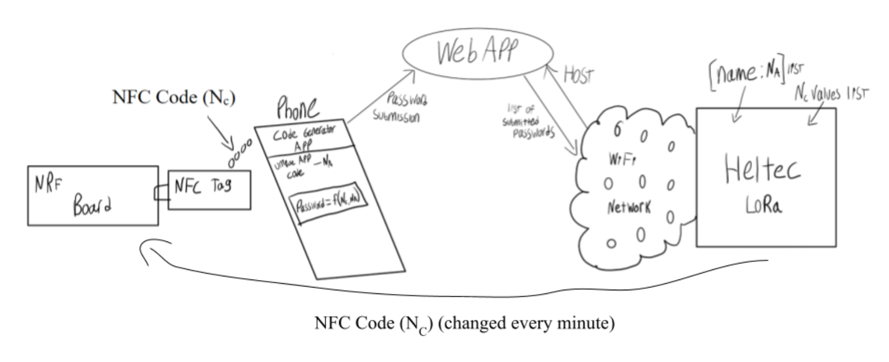
Current
classroom attendance solutions are either too easy to work around or take too
much time to perform with large classes. Our solution aims to make an automatic
system that guarantees the student’s presence in class. The process starts when
students tap their phone to an NFC tag connected to an NRF board which reads in
a key, NC. This key, NC, is generated and changed every minute by the Heltec
board and transmitted to the NRF board via Bluetooth. The students will have an
app on their phone which will provide its own unique key, NA. This key will not
be visible to the user. Once NC is read, the app will combine the two keys to
generate a new key. The Heltec board will be acting as a WiFi access point for a
private network that students can join. This network will host a web application
that students will interact with to submit their combined keys. The web app will
have access to all NA and NC values, so it will be able to identify each student
and the time that they entered class. This solution ensures that the student is
physically present in class to scan the NFC tag, and it prevents classmates from
leaking the NFC tag code by requiring an unknown key that is unique to each
student. In addition, our solution also provides the instructor with a list of
when students entered class.

## Smart Parking System

**Members:** Leena Bacha

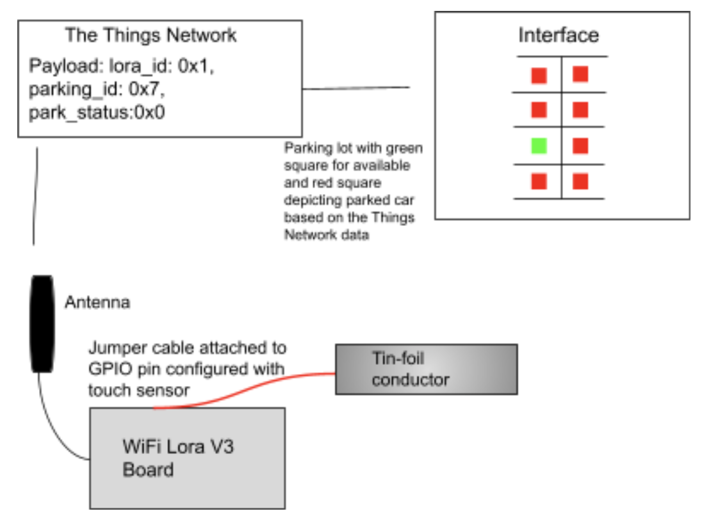
This project is a smart parking system designed to tackle the issue of parking
congestion in urban areas. Currently, there is no way to know how much parking
space is available in a parking lot until a person arrives at that parking lot.
Additionally, even at smart parking lots which shine a light over the spot green
or red based on availability tend to be incorrect when motorcycles or other
shaped vehicles park in those spots. This project tackles these issues by using
the touch sensor feature of the Wifi LoRa board which will require a vehicle to
drive over a metal conductor that would span the parking space(for this scenario
it will be aluminum foil). Once the touch sensor registers a value over the
threshold the board will register a car as being parked. The LoRa board will
simultaneously be sending updates to the Things Network with a data payload
including the LoRa board's id, the parking lot space number, and its status
(parked/not parked) based on the touch sensor. This will be linked to a viewable
interface that will show which spots are available and which are not available
based on the updated payloads sent by the LoRa board over the Things Network.
This project would allow users to know beforehand how full a parking lot is
which is especially useful in urban areas.

## LoRa Investigation

**Members:** Gabriel Binning, Shawn Kao, Nathan Lindley

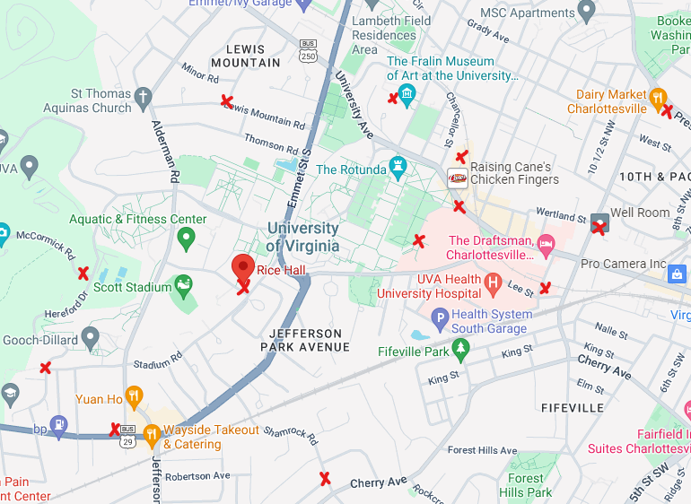
One of the primary appeals of LoRaWAN devices is its ability to dynamically
change its scattering parameter depending on the distance and geographical
interference from nearby gateways. As such, we wanted to run an experiment where
we sent packets from what we contend as vastly different locations based on
anticipated obstacles like foliages or concrete walls. For example, a place with
a higher altitude would theoretically require a lower spreading factor than a
garage in the corner. To collect our data, we chose multiple locations with
relatively similar distances from Rice Hall, the location of our designated
gateway, as well as our anticipated interference levels to see if we can chart
the required spreading factors to consistently transmit packets. We also
included multiple controls from closer and farther away from Rice Hall to help
explain our results.

## Barcode Scanner

**Members:** Daniel Biondolillo, Dagim Tekle, Samuel Veliveli

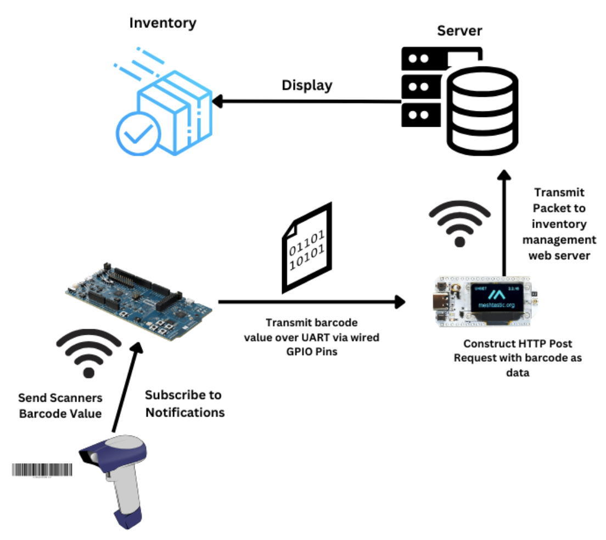
Traditional Bluetooth-based inventory systems often require a centralized
connection to desktop computers or laptops, typically used as data processing
hubs. This setup, while effective in smaller or controlled settings, is not
ideal for large-scale inventory environments like factory production floors,
warehouses, or construction sites. These locations pose unique hazards,
including dust, moisture, temperature extremes, and the constant movement of
heavy machinery, all of which can damage expensive computer equipment. The need
to repair or replace fragile hardware not only increases costs but also
introduces operational downtime, making these centralized setups less efficient
and more cumbersome.

The Bluetooth barcode scanner, paired with the nrf52840 Bluetooth board and
Heltec WiFi board, offers a modular and cost-effective alternative that
addresses these challenges. By eliminating the reliance on desktop computers or
laptops, this system significantly reduces the risk of hardware damage in
hazardous environments. Moreover, its modularity enables greater flexibility and
scalability at a lower cost, allowing Bluetooth/WiFi units to be strategically
placed throughout the site. This design extends the effective range over which
inventory can be managed, as multiple units can work in unison to cover larger
areas.

In this configuration, Bluetooth barcode scanners communicate with the nrf
Bluetooth boards, which are then wired to Heltec Wi-Fi boards. The Wi-Fi boards
connect to the internet and send inventory data to a centralized management
system. By distributing these units across the inventory environment, the system
provides broader coverage without compromising on reliability or risking damage
to expensive equipment. This modularity also means that if one unit requires
maintenance or repair, others can continue to function, ensuring that inventory
tracking remains continuous and effective.

The figure below illustrates how our system works, but we will also explain it
here. First, the nrf52840 board establishes connection with the barcode scanner
and subscribes to notifications. On scan events, the nrf52840 board reads in the
characteristic value (in this case the barcode). This value gets written over
UART (pins for wired serial communication for the other board). Then, the Heltec
WiFi board reads in the values written to UART. The WiFi board, after ensuring
it’s connected to the internet, will construct an HTTP POST request with the
barcode in the payload. The WiFi board then sends the packet to the web server
which targets a controller method to increment an inventory count for the
product associated with the barcode.

## LoRa Telemetry System

**Members:** Cole Blackman, Adam Dirting, Sean Mahoney

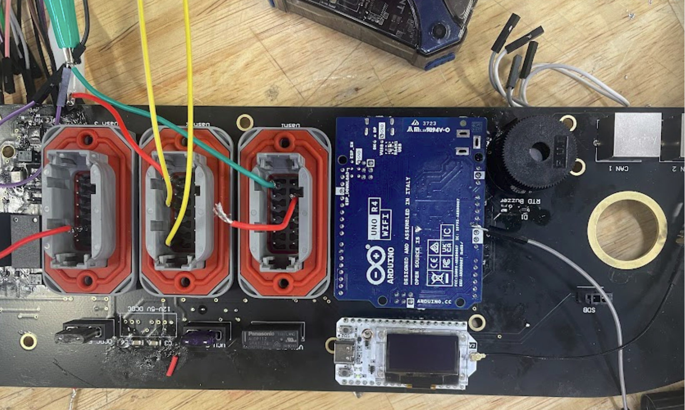
The concept of this project is to provide an extensible and flexible telemetry
system over LoRa. LoRa is a long range, low footprint option for telemetry.
Unlike 5G (which is standard on racing series such as the Indy Autonomous
Challenge (IAC)), it does not require cell service. LoRa is highly power
efficient and resistant to electronic interference, unlike WiFi. It is also less
affected by multiple other racing teams using WiFi at the same time, as it has
frequency spreading. These characteristics make it well suited to the Formula
SAE student electric racecar competition. The main goal of this project is to
provide a highly scalable solution. As new cars are constructed every year for
the Formula competition at the University of Virginia, requirements for
telemetry change and grow annually. For example, in 2024, the team shifted from
an internal combustion-driven car to an electric powertrain. This shift
drastically changed the type of data generated by the car's computer systems.
Now, it has to account for high voltage electrical systems in addition to a low
(12V) voltage system. Also, as the team pushes the envelope in terms of
performance and driver training, data analytics teams have increased demand for
detailed, high-frequency data. Two Heltec LoRa 32 v3 boards are used. One is
connected via USB to a base station (in our case, a laptop running Ubuntu). The
other is connected via USB to the car-board computer (in our case, a Jetson
module). The folder /P2P_lora_formula contains embedded code running on the
Heltec board connected to the car-board computer. /P2P_lora_receiver_formula
contains embedded code running on the Heltec board connected to the base
station. A software interface written in QT displays the live data as it is
received and has functions to save it. This code is in /base_station and runs on
the base station. We also define an extensible packet format.

## BLE Bus Support

**Members:** Shiraz Farooqui, Yashavi Prakash, Robel Woldegyorgis

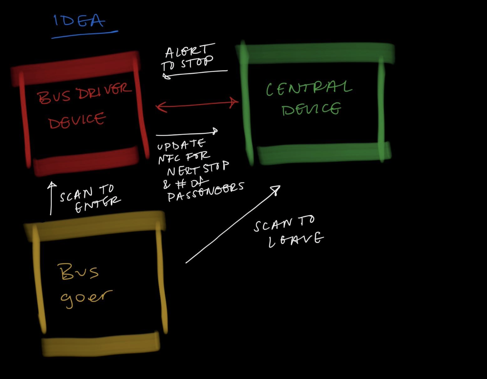

For our project, we will be creating a device that facilitates the bus
operations using BLE and NFC. There will be a peripheral device that will be the
device for the driver, and there will be a central device that will do two
things: 1) be the device that measures bus occupancy, and 2) will display the
NFC tag that will allow the occupant to “signal” that they want to step off at
the next stop.

Once the occupant has gotten on the bus, they can scan their device on the NFC
tag on the peripheral device for the bus driver, and it will increment the
number of current occupants on the bus. This NFC tag will contain records of 1)
the current bus stop, 2) the current bus occupation, and 3) the next bus stop.
This will allow the device to keep track of the number of current occupants and
the number of open seats available on the bus, given the total possible number
of open seats. The information of the bus occupation will be notified and sent
to the central device.

On the central device, the NFC part of the device will be used to allow an
occupant of the bus to signify when they will want to leave a stop, which should
allow the driver to know to stop at that stop. This NFC tag will contain records
of: 1) the geotag of the next stop, 2) the bus line (green line, red line,
etc.), and 3) the bus number. It will also update the tally on the central slide
of the expected passengers who are prepared to leave the bus, which will then be
used to update the total number of current occupants.

Once an occupant has scanned this tag, an LED on the central device will go on,
which will signify the number of occupants who are scheduled to leave. Once the
bus is approaching a stop, the driver can click a button on their peripheral
device, and signal that the bus is approaching the stop. Here, the LEDs will
blink to signify this change.

Once the bus has stopped, the LEDs will turn off, the number of current
occupants will be updated, and the number of occupants getting off the bus will
be reset to 0.

## Room Reservations

**Members:** Ethan Jenkins, Silas Shroer, Price McKinney

The state of the University of Virginia's system for reserving study rooms is
currently inefficient and difficult to use. The goal of our project is to
improve upon this system and make the process of booking a study room more
simple and user friendly. Currently, you can only reserve a room through one
website that often does not work. There is no present option for students to
quickly reserve a room, particularly in person, even if there is one empty. With
the system we are designing, students will be able to scan a NFC tag on the room
if they want to reserve a room. If the room is currently empty, the student who
wants to book the room will write their computing ID to the room and it will
reserve it for said student. Additionally, there will be a board that advertises
reservations made online using the traditional website, so the in person
recommendations and online recommendations can be synced as one efficient
system. This can be scaled to have a board for each room and one board
advertising reservations online reservations made for all of them. This design
will employ two different wireless protocols, Bluetooth Advertisements and Near
Field Communication (NFC).

## Bus Notifications

**Members:** Aaditya Ghosalkar, Alexander Johnson, David Yang

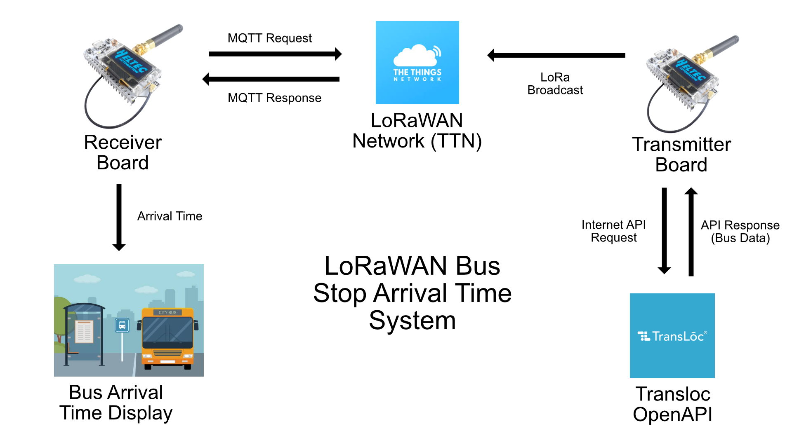
Our group has decided to work on a real-time bus stop time notification system
for students and faculty using the University transit service for allowing
waiting commuters to have reliable and up to date information about when the
next bus will arrive. Our system will provide essential improvement over the
transloc mobile app by providing commuters notification without crashes which
happen frequently over phone and fails to connect entirely. Our implementation
approaches this issue by utilizing a third-party api from OpenAI by transloc
that contains real-time data about bus routes within many university transit
services including UVA including bus arrival times for each bus stop. A lora-wan
device connected within the range of wifi will receive the data using this api
and then preprocess the data to be sent by separating bus arrival times for its
specific bus stop. This processed data will be sent through the The Things
Network to be received by another lora-wan device within the bus stop using MQTT
and this remaining time will be shown on the display attached to the device for
commuters to view.

## Garbage Can Monitoring

**Members:** Matthew Nicoud, Emmitt James, Oscar Lauth, Ethan Banerjee

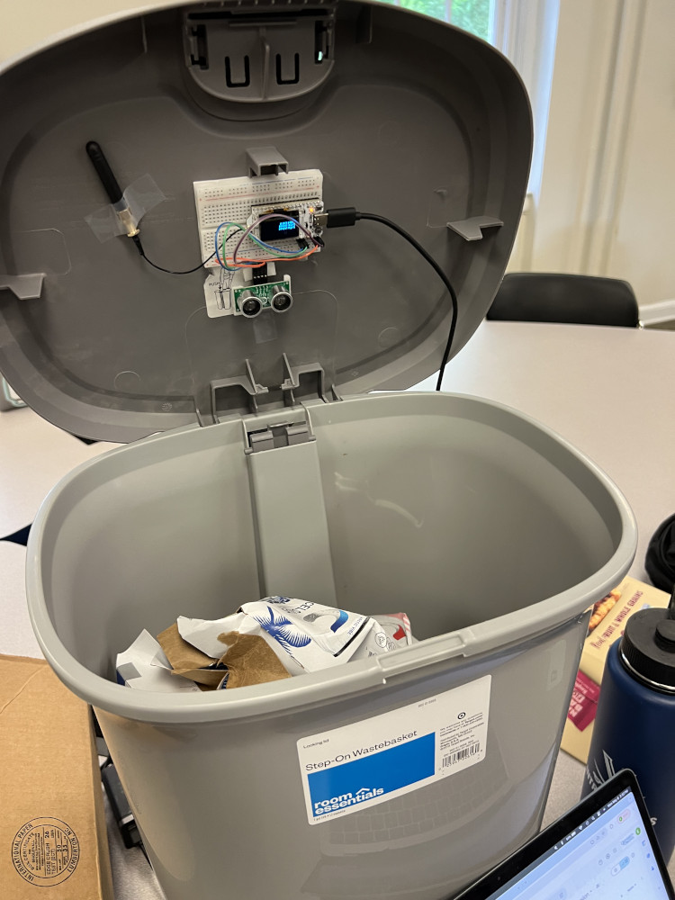
Overflowing garbage bins can become a nuisance for both people in the area and
those in charge of clearing such bins. Cleaning services currently have no way
of knowing how full garbage bins are remotely to plan their work accordingly. To
address this challenge, we have implemented a filled garbage notification system
which measures how full a garbage bin is and displays the fullness level on a
website to easily alert cleaning services when a bin needs to be replaced. On a
large scale with dozens of garbage bins being measured, this system would allow
for much more efficient usage of cleaning services so that bins are properly
maintained with minimal wasted time or resources. Our approach uses a ESP32
board and antenna with an HC-SR04 ultrasonic sensor and battery to measure how
full a garbage bin is. The ultrasonic sensor measures the distance to the top of
garbage in the bin which is used to determine the capacity of the bin. The ESP32
board transmits using LoRa for the PHY and LoRaWAN on the Mac layer. The board
joins The Things Network and transmits its payload to a nearby Things gateway.
The payload consists of an identifier specifying which deployed system/garbage
bin the packet came from and the corresponding ultrasonic sensor data. Our own
backend service interfaces with The Things Network in order to grab data from
the deployed systems using MQTT. This data is sent to the client website using
websockets where we update a map of deployments which displays the fullness
level of measured garbage bins at a designated time interval (currently every
minute for demo).

## Coffee Shop WiFi

**Members:** James Hawkins, Alexis Mann, Jessica Saviano

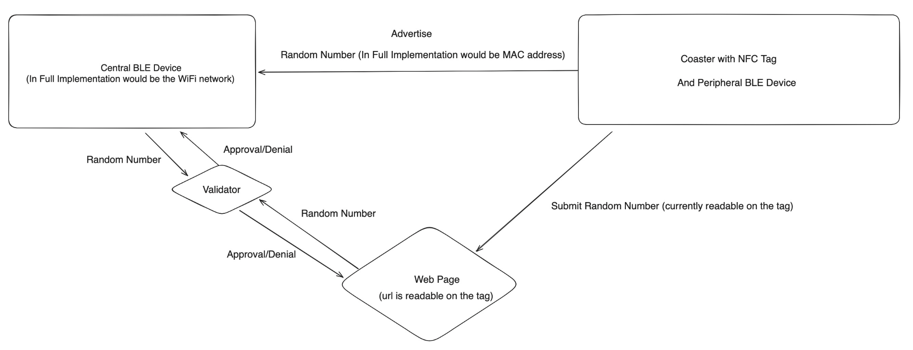
The challenge that our project is addressing is creating a system where it
allows users to scan an NFC tag to connect to a WiFi network. We imagined this
in a coffee shop where a user would be given an NFC tag embedded in a coaster
when they purchased an item from the shop. It could also be used to solve the
issue of connecting to the UVA hidden network, “wahoo.” It allows the network to
still be hidden but the user can tap the device to connect rather than having to
visit a website and entering all of their information. They could then scan the
tag to register their MAC address in the WiFi network. This system would be an
improvement upon the current system which is in many cases coffee shops writing
or printing their WiFi network and password on paper and displayed in the shop.
Our system will improve the former through preventing an overcrowding network,
promoting their business through only allowing paying customers to use their
network, and also make it an easier experience for the customer to connect to
the WiFi network as they will no longer have to worry about mistyping passwords.
In order to approach this new system, we developed a prototype in which an NFC
tag is created with two records. One of which is a randomly generated number
which mimics the user’s MAC address. The other of which is a url which goes to a
web page that allows the user to input the randomly generated number found from
the NFC tag. Once the peripheral with the NFC tag is flashed, it advertises the
randomly generated number to the central device which mimics the WiFi network.
Now that the user has the randomly generated number and so does the central
device, the user would then enter their number into the web page as a
verification step and to mimic adding their MAC address to the network.

## LoRa Spreading Factor

**Members:** Lain Bowman, Colette D'Costa, Kayenat Peera

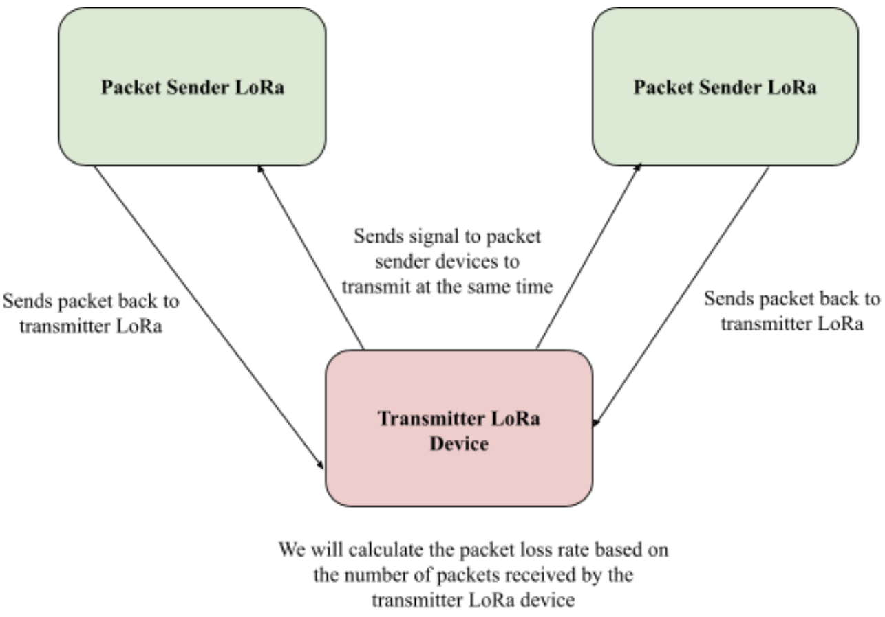
Our project is attempting to evaluate spreading factor as an element of packet
interference, and how different. Specifically, we are using the LoRa Heltec
devices, where we are able to easily change the device’s spreading factor. In
the design of our system, one LoRa device will act as a beacon, informing the
other two devices to transmit (to ensure a potential packet collision). The
other two LoRa devices will transmit back to the beacon LoRa at the same time,
where the beacon LoRa will be able to check to see if the packets had been
received. If the packets from both LoRa devices were received, it indicates that
there was no packet collision, while if a packet is not received in response, it
indicates a packet collision. The design of this project could be important to
determine the impact of spreading factors on the robustness and reliability of
data transmission. In cities where LoRa devices are used for things like
environmental monitoring and asset tracking, it is very important to ensure that
the right spreading factors are being used to make sure that the data collection
from these devices are reliable and accurate.

## GPS Tracking with the LoRa Network

**Members:** Danny Pellei, Nurbol Lampert

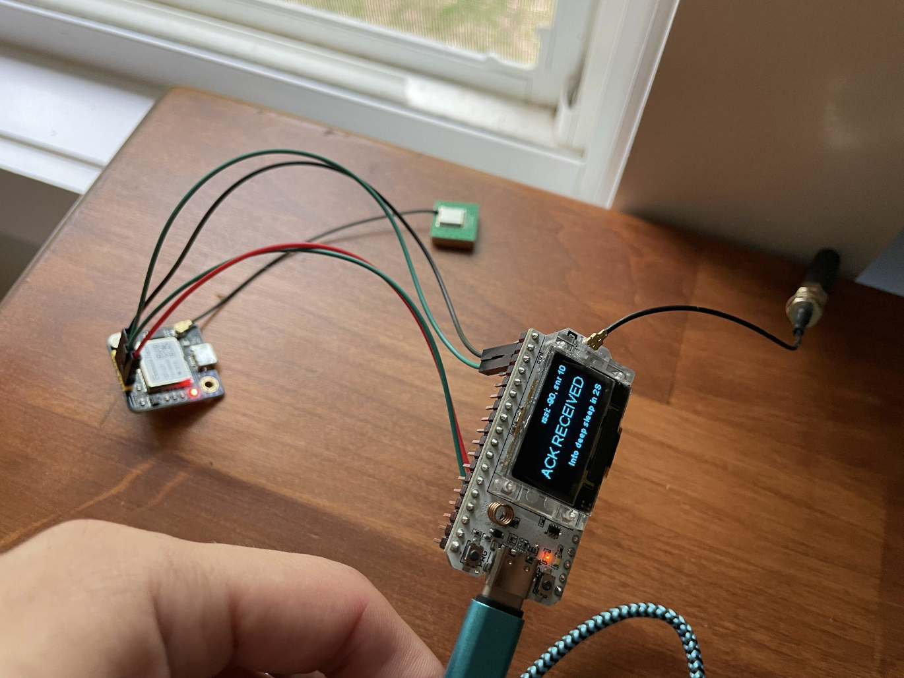
We decided to create a wireless IoT device to track other devices that use the
LoRa network. We were thinking of putting this device on a drone or other piece
of equipment that could get lost and having a location on it would always be
beneficial if lost. Since the LoRa WiFi 32 v3 doesn’t have a GPS module, we used
the GT-U7 GPS module and connected it to our LoRa board.

These are the steps that we implemented:

1. Obtains its GPS location.
2. Packages the GPS coordinates into a suitable format.
3. Joins a LoRaWAN network.
4. Sends its location data over the LoRaWAN network.
5. Pull data from The Things Network using API key
6. Decode packet to get longitude and latitude
7. Create a .csv recording the location data

Using the .csv data we tested it by tracking our location using the device and
an external battery pack. It correctly tracked our location and where we stopped
(simulating a drone crash so we can track its exact location and retrieve it).
Here is a map of the locations it tracked. It worked exactly as expected.

## Location Verification

**Members:** Anmol Sandhu, Surya Shanmugaselvam, Tobias Shaw

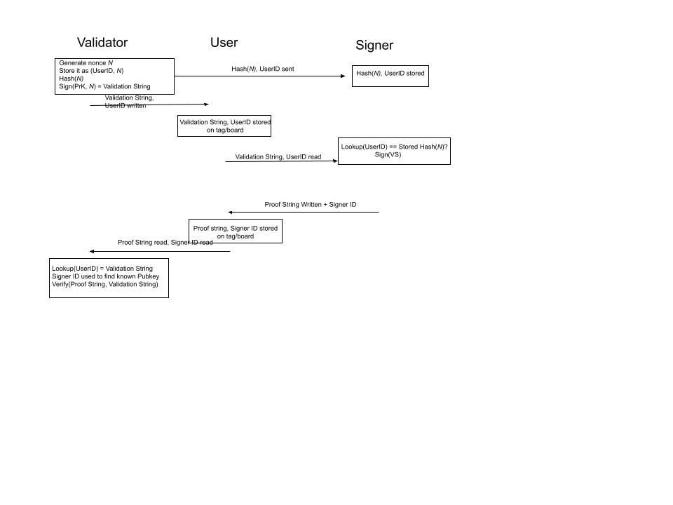
Our project aims to create a system that can cryptographically prove that a user
has been to a location. Using RFID, the user will first obtain a user-specific
nonce to identify their tag with a validator. The user will then bring their tag
with them and have it scanned and signed by the location specific signer. The
user will then bring the tag within proximity of the validator to have the
signature validated.

## Queue Management

**Members:** Jacob Templeton

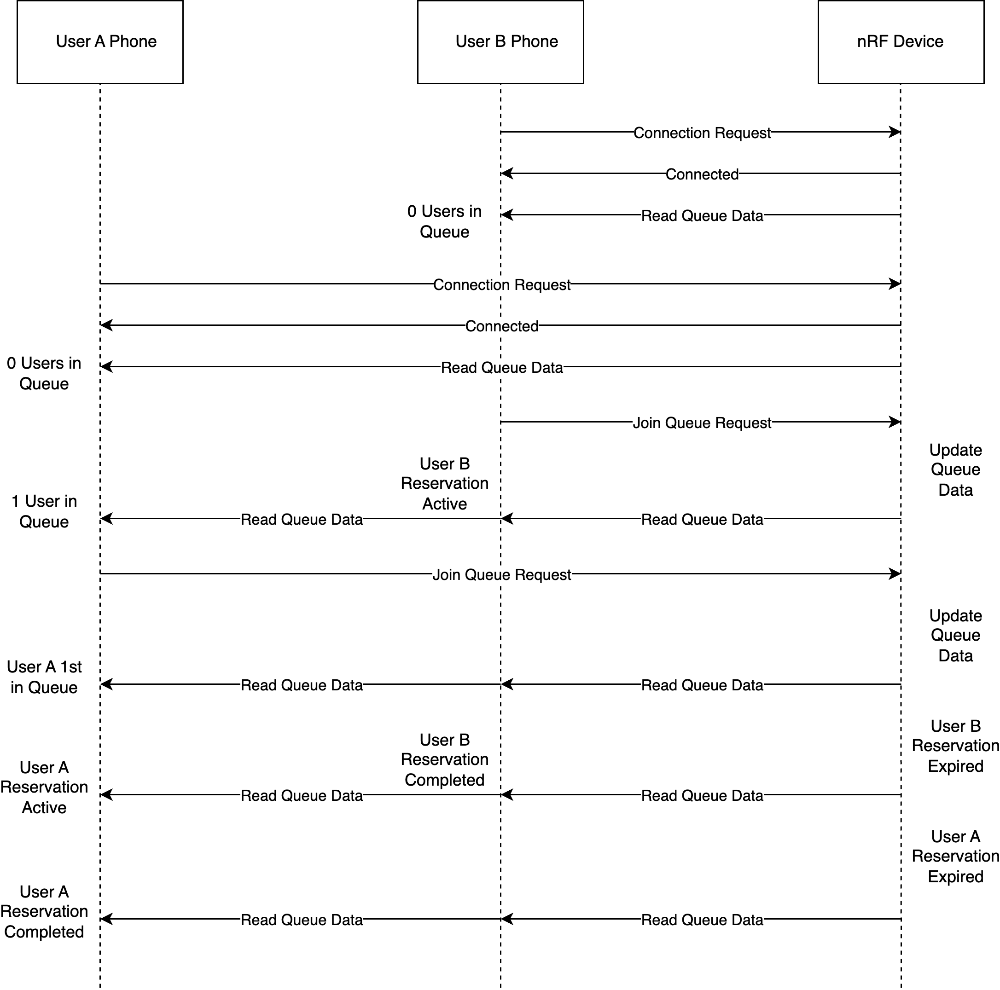
This project addresses the challenge of inefficient queue management in public
and commercial settings, such as service counters, where long wait times can
lead to frustration and decreased productivity. By integrating a wireless smart
queue management system, this project enhances users' experience by allowing
individuals to join a virtual queue using their smartphones, thereby enabling
them to use their waiting time more effectively elsewhere. The system uses a
central nRF52840 BLE hub that manages the queue in real-time. Users can join the
queue through an app, which communicates with the hub via BLE. The hub tracks
each reservation and updates all users about their position and expected wait
times. This approach simplifies the queuing process by using wireless to provide
a seamless and more efficient user experience.

## Lost and Found Tag

**Members:** Hanna Svenson, Haizhou Yu, Tong Zhou

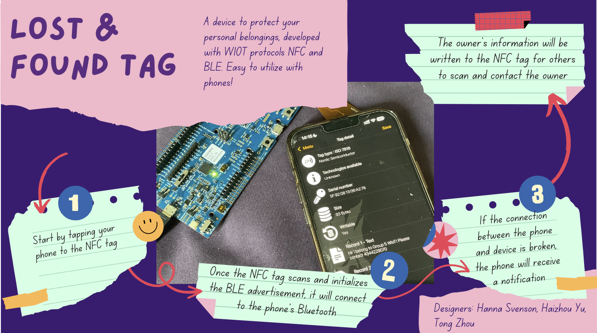
This project is designed to address the problem of a user losing or forgetting
an item that they wish to keep physically close to them, for example a wallet or
pair of keys. By connecting their phone to our device, the combination of NFC
and BLE protocols will allow the user to be notified when the device and phone
span a large enough distance for their connection to break. Imagine a user has
their device attached to their wallet. As they are leaving work, after a minute
of walking, they are notified that their device is no longer in their range.
This will allow them to act quickly to turn around and pick up their wallet
before continuing on their trip. In a scenario where the user is not able to
locate their item, there is still a chance of recovery, as the user’s contact
information will be written onto the NFC tag which can be scanned by whoever
finds the item. This mechanism will prevent users from forgetting about items
that would be very inconvenient to lose, and potentially help with the recovery
of lost items. The way the device works is to combine BLE and NFC protocols,
ensuring an effective connection under low energy. First, you need to tap the
phone to the NFC tag, which allows the device to be discovered in the phone’s
Bluetooth devices in their settings app. This is important, as the phone would
not be able to discover the device in their settings without this form of
initialization. If the connection is terminated, by the distance between the
phone and device being too large, the phone will alert the user that the device
is out of range. At this time, the tag scanner will be changed to a readable NFC
tag that contains customizable information set by the user, such as their phone
number and name.

## Morse Code Communication

**Members:** Shannon Lankford

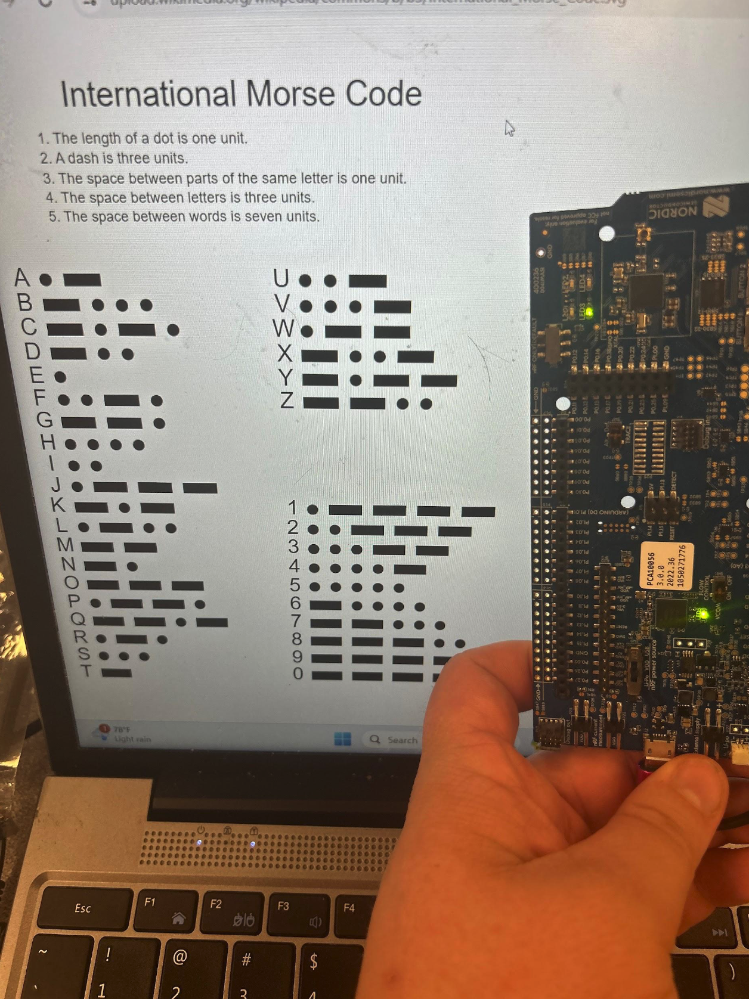
For my final Wireless Internet of Things project, I designed a code using a
peripheral UART setup that could be Bluetooth connected via a phone through the
nRF Connect App to send morse code messages to the nRF device. Once the code
begins running, LED1 and LED3 begin to alternate blinking, which will help
disguise the morse code better. Once it is time to send a message, the sender
connects to the nRF board via Bluetooth through the nRF Connect App. Once it’s
connected, LED2 will light up, signifying that the phone has connected to the
board. Then, the sender types a message to send to the board using letters and
numbers (any invalid characters will cause LED4 to light up). Then, the code is
set to iterate through the message sent and display the Morse Code as blinks
appearing from LED3 on the nRF device. This code allows for there to be
communication between the nRF device and a phone without the nRF device needing
to be connected to a COM port, so after the code is flashed to the nRF device,
all it needs is a power source to be able to transmit messages from the phone.
This could be used to send covert messages to devices across a certain distance,
especially because it just looks like any normal blinking device.
